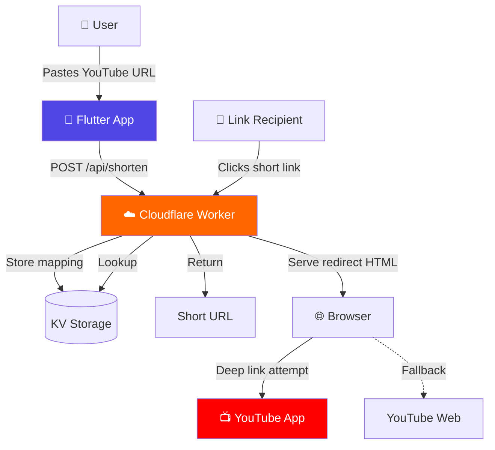
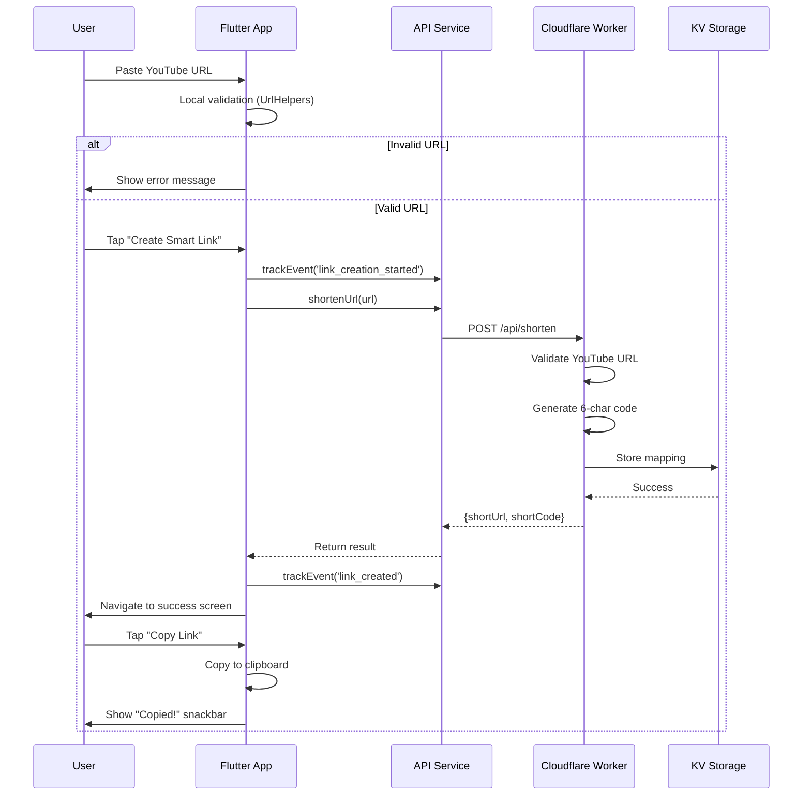
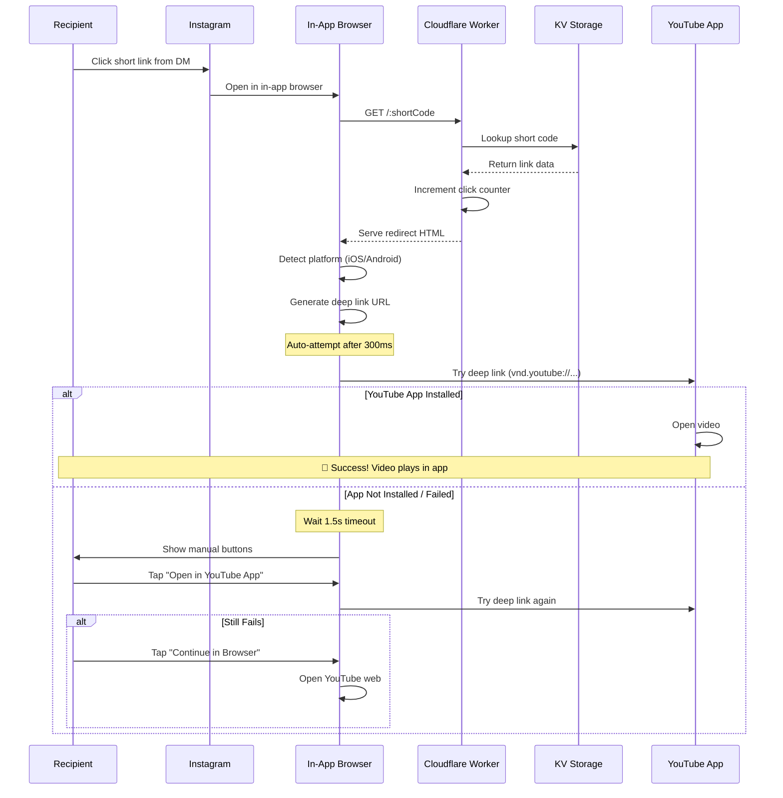

# OpenRight - Comprehensive Codebase Overview

> **Last Updated**: February 9, 2026  
> **Status**: Active Development - Production Ready

---

## 📋 Executive Summary

**OpenRight** is a mobile application that creates intelligent shortened links for YouTube videos. These smart links automatically open in the native YouTube app instead of in-app browsers when shared on social platforms like Instagram and Facebook.

### Core Value Proposition
- **Problem**: When sharing YouTube links on social media, they open in frustrating in-app browsers
- **Solution**: Smart short links with deep linking that bypass in-app browsers
- **Target Users**: Content creators, marketers, and frequent YouTube sharers

---

## 🏗️ Technology Stack

### Frontend (Mobile App)
| Component | Technology | Purpose |
|-----------|-----------|---------|
| **Framework** | Flutter 3.5.0+ | Cross-platform mobile development |
| **Language** | Dart | Application logic |
| **HTTP Client** | `http` package (^1.2.0) | REST API communication |
| **Deep Linking** | `url_launcher` (^6.2.5) | Open URLs and deep links |
| **Sharing** | `share_plus` (^7.2.2) | Native share sheet integration |
| **UI Design** | Material Design 3 | Modern, consistent UI components |

### Backend (Serverless Edge)
| Component | Technology | Purpose |
|-----------|-----------|---------|
| **Runtime** | Cloudflare Workers | Serverless edge computing |
| **Language** | JavaScript (ES6+) | Worker logic |
| **Storage** | Cloudflare KV | Key-value storage for links |
| **CDN** | Cloudflare Edge Network | Global distribution & low latency |

### Development Tools
- **Build System**: Flutter CLI, Wrangler (Cloudflare)
- **Version Control**: Git
- **Package Managers**: pub (Flutter), npm (Node.js)

---

## 📂 Project Structure

```
OpenRight/
├── lib/                          # Flutter application source
│   ├── main.dart                 # App entry point
│   ├── screens/
│   │   ├── home_screen.dart      # URL input interface (251 lines)
│   │   └── link_generated_screen.dart  # Success/share screen (237 lines)
│   ├── services/
│   │   └── api_service.dart      # Backend API client (39 lines)
│   └── utils/
│       └── url_helpers.dart      # YouTube URL validation (39 lines)
│
├── backend/                      # Cloudflare Workers backend
│   ├── worker.js                 # Main worker logic (400 lines)
│   ├── wrangler.toml             # Cloudflare configuration
│   ├── setup.sh                  # KV namespace setup script
│   └── package.json              # Dependencies
│
├── android/                      # Android platform files
├── ios/                          # iOS platform files
│
├── pubspec.yaml                  # Flutter dependencies
├── README.md                     # Comprehensive documentation
├── QUICKSTART.md                 # 5-minute setup guide
└── BUGFIX_TYPE_CASTING.md        # Migration rationale
```


---

## 🎯 Application Architecture

### High-Level Overview



---

## 🔌 API Architecture

### Backend Routes

The Cloudflare Worker ([worker.js](file:///Users/shubhashreebhat/Documents/OpenRight/backend/worker.js)) handles three main routes:

#### 1. **POST /api/shorten** - Create Short Link
```javascript
// Request
{
  "url": "https://youtube.com/watch?v=dQw4w9WgXcQ"
}

// Response (200 OK)
{
  "shortUrl": "http://localhost:8787/aB3xY9",
  "shortCode": "aB3xY9"
}

// Error (400 Bad Request)
{
  "error": "Invalid YouTube URL"
}
```

**Implementation**: Lines 60-121 in `worker.js`
- Validates YouTube URL format
- Generates 6-character random code
- Stores mapping in KV storage
- Returns shortened URL

#### 2. **GET /:shortCode** - Handle Redirect
```javascript
// Request: GET /aB3xY9
// Response: HTML page with deep linking logic
```

**Implementation**: Lines 126-148 in `worker.js`
- Looks up short code in KV
- Increments click counter (fire-and-forget)
- Serves redirect HTML with embedded JavaScript
- Auto-attempts deep link to YouTube app

#### 3. **POST /api/analytics** - Track Events
```javascript
// Request (fire-and-forget from app)
{
  "event": "link_created",
  "data": { "shortCode": "aB3xY9", "originalUrl": "..." }
}

// Response (always 200 OK)
{
  "success": true
}
```

**Implementation**: Lines 153-176 in `worker.js`
- Accepts analytics events from mobile app
- Currently logs to console (MVP)
- Designed for future analytics dashboard integration

---

## 📱 Flutter App Components

### 1. Main Application Entry ([main.dart](file:///Users/shubhashreebhat/Documents/OpenRight/lib/main.dart#L1-L28))

```dart
void main() {
  runApp(const OpenRightApp());
}

class OpenRightApp extends StatelessWidget {
  Widget build(BuildContext context) {
    return MaterialApp(
      title: 'OpenRight',
      theme: ThemeData(
        colorScheme: ColorScheme.fromSeed(
          seedColor: Color(0xFF4F46E5), // Indigo primary color
          brightness: Brightness.light,
        ),
        useMaterial3: true,
      ),
      home: const HomeScreen(),
    );
  }
}
```

**Key Decisions**:
- Material Design 3 for modern UI
- Indigo (#4F46E5) as primary brand color
- Single-screen navigation (no complex routing needed for MVP)

---

### 2. Home Screen ([home_screen.dart](file:///Users/shubhashreebhat/Documents/OpenRight/lib/screens/home_screen.dart))

**Purpose**: Main URL input interface where users paste YouTube links

#### State Management
```dart
class _HomeScreenState extends State<HomeScreen> {
  final TextEditingController _urlController = TextEditingController();
  bool _isLoading = false;
  String? _errorMessage;
}
```

#### Key Methods

**`_handleCreateLink()`** (Lines 25-92)
```dart
Future<void> _handleCreateLink() async {
  // 1. Validate URL locally
  if (!UrlHelpers.isYouTubeUrl(url)) {
    setState(() => _errorMessage = 'Invalid YouTube URL');
    return;
  }
  
  // 2. Track event
  ApiService.trackEvent('link_creation_started', {'url': url});
  
  // 3. Call backend API
  final result = await ApiService.shortenUrl(url);
  
  // 4. Track success
  ApiService.trackEvent('link_created', {...});
  
  // 5. Navigate to success screen
  Navigator.push(context, MaterialPageRoute(...));
}
```

**UI Features**:
- Real-time URL validation
- Paste from clipboard button
- Clear input button
- Loading state with spinner
- Error message display
- Disabled button when invalid URL

---

### 3. Link Generated Screen ([link_generated_screen.dart](file:///Users/shubhashreebhat/Documents/OpenRight/lib/screens/link_generated_screen.dart))

**Purpose**: Display generated short link with copy/share actions

#### Key Methods

**`_handleCopy()`** (Lines 23-50)
```dart
Future<void> _handleCopy() async {
  // 1. Copy to clipboard
  await Clipboard.setData(ClipboardData(text: widget.shortUrl));
  
  // 2. Show visual feedback
  setState(() => _copied = true);
  
  // 3. Track analytics
  ApiService.trackEvent('link_copied', {'shortCode': widget.shortCode});
  
  // 4. Show snackbar notification
  ScaffoldMessenger.of(context).showSnackBar(...);
  
  // 5. Reset button state after 2 seconds
  Future.delayed(Duration(seconds: 2), () => _copied = false);
}
```

**`_handleShare()`** (Lines 52-64)
```dart
Future<void> _handleShare() async {
  await Share.share(widget.shortUrl, subject: 'Share YouTube Link');
  ApiService.trackEvent('link_shared', {'shortCode': widget.shortCode});
}
```

**UI Features**:
- Success icon animation
- Tappable URL display for quick copy
- Primary "Copy Link" button with state change
- Secondary "Share" button (native share sheet)
- Info box explaining deep linking benefit
- "Create Another Link" navigation

---

### 4. API Service ([api_service.dart](file:///Users/shubhashreebhat/Documents/OpenRight/lib/services/api_service.dart))

**Purpose**: Centralized HTTP client for backend communication

```dart
class ApiService {
  static const String _baseUrl = 'http://localhost:8787';
  
  static Future<Map<String, dynamic>> shortenUrl(String url) async {
    final response = await http.post(
      Uri.parse('$_baseUrl/api/shorten'),
      headers: {'Content-Type': 'application/json'},
      body: jsonEncode({'url': url}),
    );
    
    if (response.statusCode == 200) {
      return jsonDecode(response.body);
    } else {
      throw Exception(error['error'] ?? 'Failed to shorten URL');
    }
  }
  
  static void trackEvent(String event, Map<String, dynamic> data) {
    // Fire-and-forget analytics
    http.post(...).catchError((_) {});
  }
}
```

**Design Notes**:
- Development mode uses `localhost:8787`
- Production should use deployed Workers URL
- Analytics tracking fails silently (non-critical)
- Simple error handling with user-friendly messages

---

### 5. URL Helpers ([url_helpers.dart](file:///Users/shubhashreebhat/Documents/OpenRight/lib/utils/url_helpers.dart))

**Purpose**: YouTube URL validation and manipulation

#### `isYouTubeUrl(String url)` (Lines 5-14)
```dart
static bool isYouTubeUrl(String url) {
  final youtubeRegex = RegExp(
    r'^(https?://)?(www\.|m\.)?(youtube\.com/watch\?v=|youtu\.be/)([a-zA-Z0-9_-]{11})',
    caseSensitive: false,
  );
  return youtubeRegex.hasMatch(url);
}
```

**Supported Formats**:
- `https://www.youtube.com/watch?v=dQw4w9WgXcQ`
- `https://youtu.be/dQw4w9WgXcQ`
- `https://m.youtube.com/watch?v=dQw4w9WgXcQ`
- `http://youtube.com/watch?v=...` (http allowed)

#### `extractYouTubeId(String url)` (Lines 17-29)
```dart
static String? extractYouTubeId(String url) {
  // Handle youtu.be format
  final shortMatch = RegExp(r'youtu\.be/([a-zA-Z0-9_-]{11})').firstMatch(url);
  if (shortMatch != null) return shortMatch.group(1);
  
  // Handle youtube.com format
  final longMatch = RegExp(r'[?&]v=([a-zA-Z0-9_-]{11})').firstMatch(url);
  if (longMatch != null) return longMatch.group(1);
  
  return null;
}
```

---

## ☁️ Backend Components

### Cloudflare Worker ([worker.js](file:///Users/shubhashreebhat/Documents/OpenRight/backend/worker.js))

#### Request Routing (Lines 8-54)
```javascript
export default {
  async fetch(request, env) {
    const url = new URL(request.url);
    const path = url.pathname;
    
    // CORS configuration for mobile app
    const corsHeaders = {
      'Access-Control-Allow-Origin': '*',
      'Access-Control-Allow-Methods': 'GET, POST, OPTIONS',
      'Access-Control-Allow-Headers': 'Content-Type',
    };
    
    // Route handlers
    if (path === '/api/shorten' && request.method === 'POST') {
      return await handleShorten(request, env, corsHeaders);
    }
    
    if (path === '/api/analytics' && request.method === 'POST') {
      return await handleAnalytics(request, env, corsHeaders);
    }
    
    if (path.length > 1 && !path.startsWith('/api')) {
      return await handleRedirect(request, env, path);
    }
  }
}
```

---

#### Short Code Generation (Lines 194-201)
```javascript
function generateShortCode() {
  const chars = 'abcdefghijklmnopqrstuvwxyzABCDEFGHIJKLMNOPQRSTUVWXYZ0123456789';
  let code = '';
  for (let i = 0; i < 6; i++) {
    code += chars.charAt(Math.floor(Math.random() * chars.length));
  }
  return code;
}
```

**Characteristics**:
- 6 characters long → 62^6 = ~56 billion combinations
- Case-sensitive alphanumeric (a-z, A-Z, 0-9)
- No collision detection (acceptable for MVP/low volume)
- Random generation (not sequential for privacy)

---

#### KV Storage Schema
```javascript
// Key: shortCode (e.g., "aB3xY9")
// Value: JSON object
{
  "originalUrl": "https://youtube.com/watch?v=dQw4w9WgXcQ",
  "videoId": "dQw4w9WgXcQ",
  "createdAt": "2026-02-09T16:45:30.123Z",
  "clicks": 42,
  "lastClickedAt": "2026-02-09T17:12:45.678Z"
}
```

**KV Operations**:
- `env.LINKS.put(shortCode, JSON.stringify(linkData))` - Store link
- `env.LINKS.get(shortCode)` - Retrieve link
- Fire-and-forget click counter updates (non-blocking)

---

#### Redirect Page Generation (Lines 227-399)

**Deep Linking Strategy**:
```javascript
// iOS: vnd.youtube://watch?v=<videoId>
// Android: vnd.youtube://<videoId>
// Desktop: Direct redirect to YouTube web

if (isIOS) {
  deepLink = `vnd.youtube://watch?v=${videoId}`;
} else if (isAndroid) {
  deepLink = `vnd.youtube://${videoId}`;
}
```

**Fallback Mechanism**:
1. **Auto-attempt** (300ms delay): Try deep link automatically
2. **Timeout check** (1.5s): If app doesn't open, show manual buttons
3. **User action**: "Open in YouTube App" button as backup
4. **Final fallback**: "Continue in Browser" button

**User Experience Flow**:
```
Click short link
    ↓
Load redirect page (shows "Opening YouTube..." with spinner)
    ↓
Auto-attempt deep link (300ms delay)
    ↓
    ├─ ✅ YouTube app opens → Success!
    │
    └─ ❌ App doesn't open (1.5s timeout)
        ↓
        Show manual buttons:
        - "Open in YouTube App" (tries deep link again)
        - "Continue in Browser" (fallback to web)
```

---

## 🔄 Data Flow Diagrams

### User Journey 1: Creating a Short Link



---

### User Journey 2: Opening a Short Link



---

## 🎨 Design System

### Color Palette
```dart
// Primary Color (Indigo)
const primaryColor = Color(0xFF4F46E5);

// Background
const scaffoldBackground = Color(0xFFFAFAFA);

// Material Design 3 generates variants automatically:
// - primaryContainer
// - onPrimary
// - onSurfaceVariant
// - etc.
```

### Typography
- **Font Family**: System default (-apple-system, Roboto)
- **Headline Large**: Bold, Primary color
- **Body Large/Medium**: Regular weight
- **Body Small**: Lighter color for secondary text

### Spacing System
- **Vertical rhythm**: 8px base unit (8, 16, 24, 32, 40, 48)
- **Padding**: 24px standard screen padding
- **Border radius**: 12px for buttons, inputs, cards

---

## 🔐 Security & Privacy

### Current Security Posture

> [!WARNING]
> This is an MVP implementation. Production deployment requires additional security measures.

**Implemented**:
- ✅ CORS configuration for mobile app
- ✅ YouTube URL validation (prevents arbitrary URL shortening)
- ✅ Non-sequential short codes (privacy by obscurity)
- ✅ HTTPS enforcement (Cloudflare automatic)

**Missing (Future Enhancement)**:
- ⚠️ Rate limiting on `/api/shorten`
- ⚠️ Short code collision detection
- ⚠️ Link expiration mechanism
- ⚠️ User authentication for analytics
- ⚠️ Abuse prevention (spam detection)

---

## 📊 Analytics & Tracking

### Frontend Events
```javascript
// Tracked in Flutter app via ApiService.trackEvent()

'link_creation_started' → { url }
'link_created'          → { shortCode, originalUrl }
'link_creation_failed'  → { error, url }
'link_copied'           → { shortCode }
'link_shared'           → { shortCode }
```

### Backend Metrics
```javascript
// Stored in KV storage per link
{
  clicks: 42,                           // Total clicks
  lastClickedAt: "2026-02-09T17:12:45"  // Last access time
}
```

**Current State**: Analytics tracked but not visualized (MVP)

**Future Enhancement**: Dashboard to display:
- Total links created
- Click-through rates
- Geographic distribution
- Platform breakdown (iOS vs Android)

---

## 🚀 Deployment Configuration

### Backend (Cloudflare Workers)

**wrangler.toml** ([view file](file:///Users/shubhashreebhat/Documents/OpenRight/backend/wrangler.toml))
```toml
name = "openright-worker"
main = "worker.js"
compatibility_date = "2024-01-01"

[[kv_namespaces]]
binding = "LINKS"
id = "e86e343138f14071886d9bc3bdc3a697"
```

**Deployment Commands**:
```bash
cd backend
npx wrangler login      # Authenticate with Cloudflare
npx wrangler deploy     # Deploy to production
```

**Free Tier Limits**:
- 100,000 requests/day
- 1 GB KV storage
- Global CDN distribution

---

### Frontend (Flutter App)

**pubspec.yaml** ([view file](file:///Users/shubhashreebhat/Documents/OpenRight/pubspec.yaml#L1-L31))
```yaml
name: openright
description: Smart link shortener for YouTube videos
version: 1.0.0+1

environment:
  sdk: ^3.5.0

dependencies:
  flutter:
    sdk: flutter
  http: ^1.2.0           # REST API client
  url_launcher: ^6.2.5   # Deep linking
  share_plus: ^7.2.2     # Native sharing
```

**Build Commands**:
```bash
# Android APK
flutter build apk --release

# iOS IPA
flutter build ios --release

# For app stores (requires Expo EAS or equivalent)
# Update ApiService._baseUrl to production URL first
```

---

## 🧪 Testing Strategy

### Current Testing

**Manual Testing**:
1. Start backend: `cd backend && npm run dev`
2. Start app: `flutter run -d emulator-5554`
3. Paste URL: `https://youtube.com/watch?v=dQw4w9WgXcQ`
4. Verify short link generation
5. Test copy/share functionality

**Deep Link Testing** (Physical Device Required):
1. Generate short link in app
2. Send via Instagram DM to self
3. Click link from Instagram
4. Verify YouTube app opens automatically

---

### Future Testing Needs

> [!TIP]
> The following test infrastructure is recommended before production:

**Unit Tests** (Not yet implemented):
```dart
// test/url_helpers_test.dart
test('validates YouTube URLs correctly', () {
  expect(UrlHelpers.isYouTubeUrl('https://youtube.com/watch?v=abc123'), true);
  expect(UrlHelpers.isYouTubeUrl('https://vimeo.com/123'), false);
});

// test/api_service_test.dart
test('handles API errors gracefully', () async {
  // Mock HTTP client...
});
```

**Integration Tests**:
```dart
// integration_test/app_test.dart
testWidgets('create and share link flow', (tester) async {
  // 1. Enter URL
  // 2. Tap create
  // 3. Verify navigation
  // 4. Test copy button
});
```

---

## 💡 Key Design Decisions

### 1. Flutter for Mobile Development
**Decision**: Use Flutter for cross-platform mobile app  
**Rationale**: 
- Single codebase for iOS/Android
- Excellent control over platform-specific behavior
- Strong community support for deep linking
- Material Design 3 built-in
- Fast hot reload for development

---

### 2. Cloudflare Workers for Backend
**Decision**: Use serverless edge computing instead of traditional server  
**Rationale**:
- Zero server management
- Global distribution (low latency worldwide)
- Free tier sufficient for MVP (100k requests/day)
- Built-in KV storage
- No cold starts

**Trade-offs**:
- Cloudflare vendor lock-in
- Limited compute time per request (50ms CPU time)
- KV storage eventual consistency

---

### 3. Client-Side URL Validation
**Decision**: Validate YouTube URLs in both Flutter app and Worker  
**Rationale**:
- **Frontend validation**: Immediate user feedback, no network round-trip
- **Backend validation**: Security boundary, prevent abuse

**Implementation**:
- Same regex pattern in Dart ([url_helpers.dart](file:///Users/shubhashreebhat/Documents/OpenRight/lib/utils/url_helpers.dart#L8-L11)) and JavaScript ([worker.js](file:///Users/shubhashreebhat/Documents/OpenRight/backend/worker.js#L206-L208))

---

### 4. Fire-and-Forget Analytics
**Decision**: Analytics tracking failures don't block user flows  
**Rationale**:
- Analytics are non-critical to core functionality
- Silent failures improve UX (no error messages for analytics)
- Prevents backend issues from breaking app

**Implementation**:
```dart
// Flutter: Silent catch
ApiService.trackEvent(...).catchError((_) {});

// Worker: Always return 200 OK
return new Response(JSON.stringify({ success: false }), { status: 200 });
```

---

### 5. 6-Character Short Codes
**Decision**: Use 6-character alphanumeric codes (not sequential)  
**Rationale**:
- **Collision resistance**: 62^6 = ~56 billion combinations
- **Privacy**: Random codes prevent link enumeration
- **Aesthetics**: Short enough for easy sharing

**Trade-offs**:
- No collision detection in MVP (acceptable for low volume)
- Not as short as services like bit.ly (typically 5-7 chars)

---

### 6. Auto-Redirect with Fallback
**Decision**: Attempt automatic deep link, show buttons after timeout  
**Rationale**:
- **Best case**: Seamless experience (app opens immediately)
- **Fallback**: Manual button for edge cases

**User Experience**:
- 300ms delay before auto-attempt (prevents jarring immediate redirect)
- 1.5s timeout before showing fallback (balance between patience and frustration)

---

## 🔮 Future Enhancements

From [README.md](file:///Users/shubhashreebhat/Documents/OpenRight/README.md#L236-L243):

- [ ] **Custom Short Domains**: Use branded domain like `oprt.link`
- [ ] **Analytics Dashboard**: Visualize click data, geographic distribution
- [ ] **Multi-Platform Support**: Extend to Vimeo, Spotify, TikTok
- [ ] **QR Code Generation**: Generate QR codes for physical marketing
- [ ] **Link Expiration**: Time-limited links for campaigns
- [ ] **User Accounts**: Optional accounts for link management
- [ ] **Custom Redirect Pages**: Branded landing pages with preview

---

## 📚 Additional Documentation

- **[README.md](file:///Users/shubhashreebhat/Documents/OpenRight/README.md)**: Comprehensive project documentation (256 lines)
- **[QUICKSTART.md](file:///Users/shubhashreebhat/Documents/OpenRight/QUICKSTART.md)**: 5-minute setup guide
- **[BUGFIX_TYPE_CASTING.md](file:///Users/shubhashreebhat/Documents/OpenRight/BUGFIX_TYPE_CASTING.md)**: Historical reference for migration decision
- **[backend/SETUP_COMPLETE.md](file:///Users/shubhashreebhat/Documents/OpenRight/backend/SETUP_COMPLETE.md)**: Backend setup verification

---

## 🛠️ Development Environment

### Currently Running Services
```bash
# Backend (Terminal 1)
cd /Users/shubhashreebhat/Documents/OpenRight/backend
npm run dev  # Running for 8m47s on http://localhost:8787

# Flutter App (Terminal 2)
cd /Users/shubhashreebhat/Documents/OpenRight
flutter run -d emulator-5554  # Running for 9m28s on Android emulator
```

### Environment Setup
```bash
# Prerequisites
- Flutter 3.5.0+
- Dart SDK
- Node.js 20+
- Cloudflare account (free tier)

# Installation
flutter pub get                # Install Flutter dependencies
cd backend && npm install      # Install Wrangler
flutter pub get                # Install Flutter dependencies
```

---

## 🎓 Learning Resources

For developers new to this codebase:

1. **Start Here**: [QUICKSTART.md](file:///Users/shubhashreebhat/Documents/OpenRight/QUICKSTART.md)
2. **Understand the Why**: [BUGFIX_TYPE_CASTING.md](file:///Users/shubhashreebhat/Documents/OpenRight/BUGFIX_TYPE_CASTING.md)
3. **Deep Dive**: This document (you are here!)

**Key Files to Read** (in order):
1. [lib/main.dart](file:///Users/shubhashreebhat/Documents/OpenRight/lib/main.dart) - App entry point
2. [lib/screens/home_screen.dart](file:///Users/shubhashreebhat/Documents/OpenRight/lib/screens/home_screen.dart) - Main UI logic
3. [lib/services/api_service.dart](file:///Users/shubhashreebhat/Documents/OpenRight/lib/services/api_service.dart) - Backend communication
4. [backend/worker.js](file:///Users/shubhashreebhat/Documents/OpenRight/backend/worker.js) - Backend logic

---

## 📞 Support & Maintenance

**Active Development**: Yes (as of February 2026)  
**Status**: MVP complete, testing phase  
**Next Milestone**: Production deployment with custom domain

---

*This overview was generated on February 9, 2026, based on the current state of the OpenRight codebase.*
